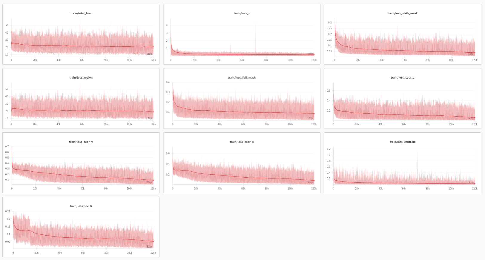
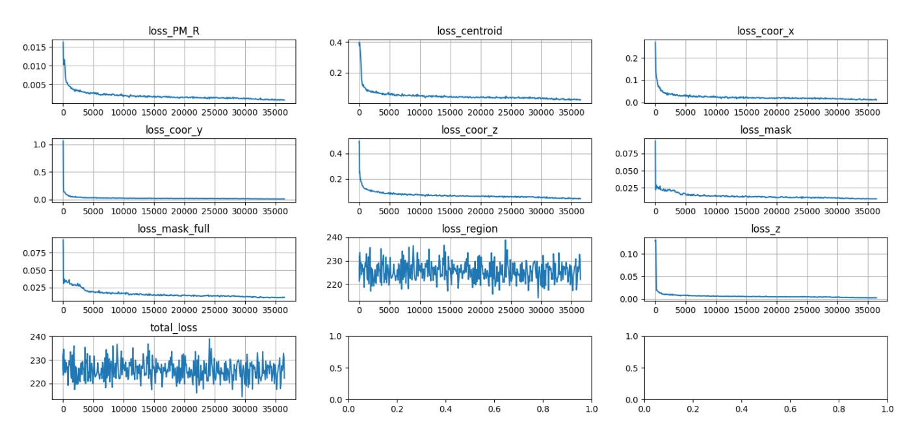
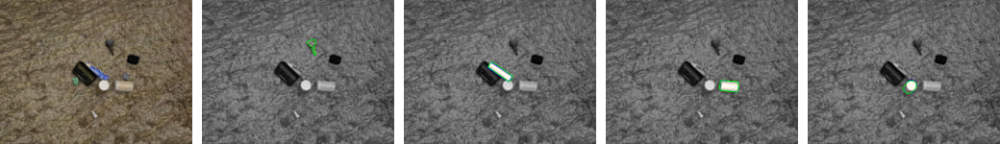

# GDRNPP for BOP2022

This repo provides code and models for GDRNPP_BOP2022, **winner (most of the awards) of the BOP Challenge 2022 at ECCV'22 and <b> customized for neura_objects</b>. For more information, please read through the paper [[arXiv](https://arxiv.org/pdf/2102.12145)]

# Tested environments
<ol>
    <li> Ubuntu 22.04 & python = 3.8.20 & CUDA 12.6. </li> 
</ol>

# 1.0 Requirements
* Install `detectron2` from [source](https://github.com/facebookresearch/detectron2)
* `sh scripts/install_deps.sh`
* Compile the cpp extensions for 
1. `farthest points sampling (fps)`
2. `flow`
3. `uncertainty pnp`
4. `ransac_voting`
5. `chamfer distance`
6. `egl renderer`

    ```
    sh ./scripts/compile_all.sh
    ```
    
7. `pip install -r requirements/requirements.txt`

# 2.0 Dataset preparation
The structure of `data` folder should look like below:
```
data/
├── BOP_DATASETS                # https://bop.felk.cvut.cz/datasets/
    ├──cc_textures              # necessary only for generating fake data
    ├──distractor_objects       # necessary only for generating fake data
    └──neura_objects
       ├──models
       │  ├──obj_000001         
       │  ├──    .
       │  ├──    .
       │  ├──obj_00000n
       │  ├──fps_points.pkl     # generate farthest point sampling based on CAD
       │  └──models_____.pkl    # generate extents and etc based on CAD
       ├──test
       │  ├──depth (optional)      
       │  ├──masks
       │  ├──rgb
       │  ├──coco_annotations.json
       │  └──per_object_annotations.h5
       ├──train
       │  ├──depth (optional)      
       │  ├──masks
       │  ├──rgb
       │  ├──coco_annotations.json
       │  └──per_object_annotations.h5
       └──val
          ├──depth (optional)      
          ├──masks
          ├──rgb
          ├──coco_annotations.json
          └──per_object_annotations.h5
```


## 2.1 How to Generate Your Own model_.pkl?
Please change the following in `ref/neura_object` to setup GDRNPP properly.

### 2.1.1 What to change?
1. Change the variable `id2obj` in `object_info.yaml`.
2. Change the variable `diameters` of the model which can be found in `object_info.yaml`

## 2.2 How to Generate Your Own fps_points.pkl?
1. `cd core/gdrn_modeling/tools/neura_objects`
2. `python3 neura_object_compute_fps.py`
## 2.3 How to Generate Your Own objects_info.yaml?
By running neura blenderproc with the necessary CAD files, it should generate `objects_info.yaml`

## 2.4 [Optional] Sanity Test
 Try running the notebooks in `/core/gdrn_modeling/datasets/data_loader_test_back.ipynb` to understand the data and ensure that the dataset is prepared correctly.
  
## 3.0 Training 

`./core/gdrn_modeling/train_gdrn.sh <config_path> <gpu_ids> (other args)`


For example:

`./core/gdrn_modeling/train_gdrn.sh configs/gdrn/neura_object/convnext_a6_AugCosyAAEGray_BG05_mlL1_DMask_amodalClipBox_classAware_neura_object.py 0`

The training result should look like:<br>


If your results look like below, please <b>stop</b: <br>


## 4.0 Testing 

1.`./core/gdrn_modeling/test_gdrn.sh <config_path> <gpu_ids> <ckpt_path> (other args)`

For example:

`./core/gdrn_modeling/test_gdrn.sh configs/gdrn/neura_object/convnext_a6_AugCosyAAEGray_BG05_mlL1_DMask_amodalClipBox_classAware_neura_object.py 0 output/gdrn/neura/convnext_a6_AugCosyAAEGray_BG05_mlL1_DMask_amodalClipBox_classAware_neura/model_final.pth`

This generates two files: results.pkl & results_list.pkl (we will be using results_list.pkl)

[Optional] Generate csv file

2.Set SAVE_RESULTS_ONLY = False in `configs/_base_/gdrn_base.py` then <br>
`python3 ./core/gdrn_modeling/tools/neura_objects/neura_object_vis_poses_full.py --pred_path output/gdrn/neura/convnext_a6_AugCosyAAEGray_BG05_mlL1_DMask_amodalClipBox_classAware_neura/inference_model_final/neura_test/results_list.pkl --output_path ./output/gdrn/neura/convnext_a6_AugCosyAAEGray_BG05_mlL1_DMask_amodalClipBox_classAware_neura/vis_full_pose`

[Optional] Visualization

3.`python3 ./core/gdrn_modeling/tools/neura_objects/neura_object_vis_poses_full.py --pred_path output/gdrn/neura/convnext_a6_AugCosyAAEGray_BG05_mlL1_DMask_amodalClipBox_classAware_neura/inference_model_final/neura_test/results_list.pkl --output_path ./output/gdrn/neura/convnext_a6_AugCosyAAEGray_BG05_mlL1_DMask_amodalClipBox_classAware_neura/vis_full_pose`

Your results should look like:<br>


## 5.0 Inference
Example <br>
`python3 ./core/gdrn_modeling/inference.py --img_path ./data/BOP_DATASETS/neura_objects/test/rgb/scene_000019_frame_000001.jpg   --bbox "292 340  79  64"   --obj_id 1   --camera_matrix "626.01318359375 0.0 318.0113830566406 0.0 627.7288208007812 240.75599670410156 0.0 0.0 1.0"   --model_info ./data/BOP_DATASETS/neura_objects/models/models_japanese_bell_supermarket_pringles_supermarket_schoko_nuss_wuerth_color_powder_wuerth_duct_tape.pkl   --model_path ./model_final.pth   --visualize True`

## Citing GDRNPP

If you use GDRNPP in your research, please use the following BibTeX entries.

```BibTeX
@article{liu2025gdrnpp,
  title     = {GDRNPP: A Geometry-guided and Fully Learning-based Object Pose Estimator},
  author    = {Liu, Xingyu and Zhang, Ruida and Zhang, Chenyangguang and Wang, Gu and Tang, Jiwen and Li, Zhigang and Ji, Xiangyang},
  journal   = {IEEE Transactions on Pattern Analysis and Machine Intelligence (TPAMI)},
  year      = {2025},
}

@InProceedings{Wang_2021_GDRN,
    title     = {{GDR-Net}: Geometry-Guided Direct Regression Network for Monocular 6D Object Pose Estimation},
    author    = {Wang, Gu and Manhardt, Fabian and Tombari, Federico and Ji, Xiangyang},
    booktitle = {IEEE/CVF Conference on Computer Vision and Pattern Recognition (CVPR)},
    month     = {June},
    year      = {2021},
    pages     = {16611-16621}
}
```
